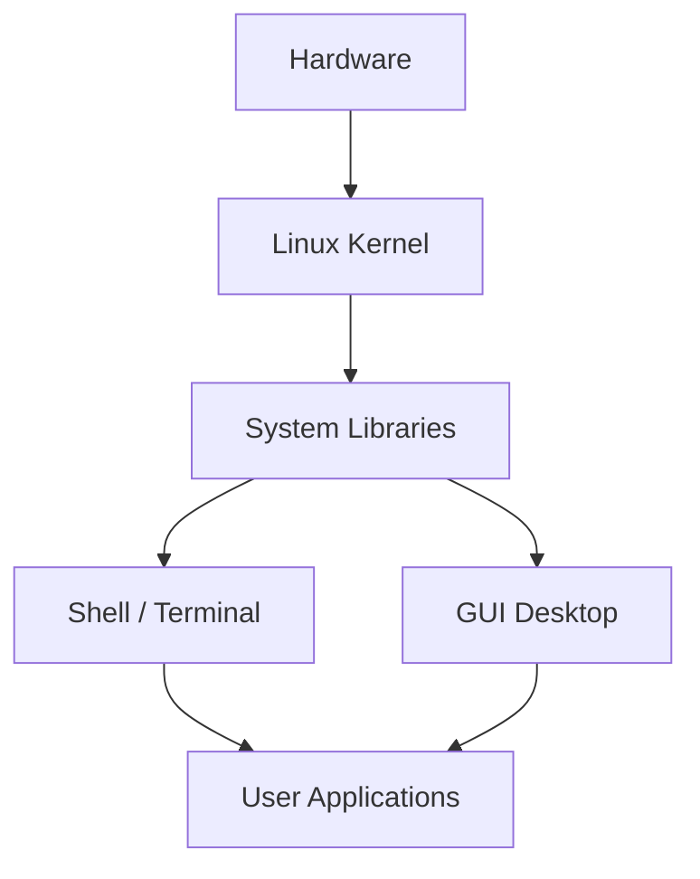
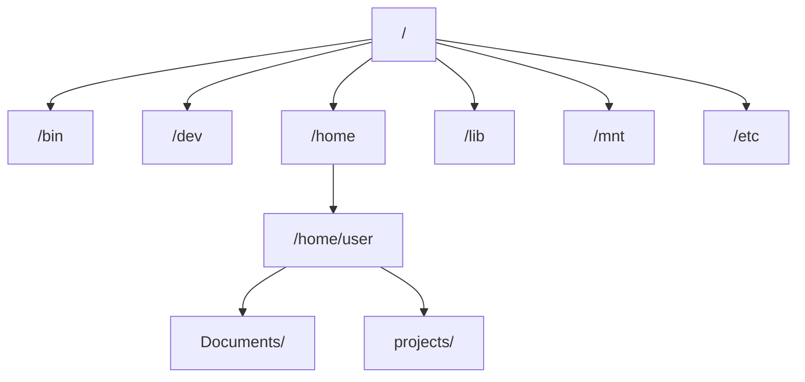
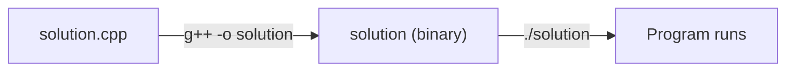

# Introduction to Linux
<div class="abs-br m-6 flex gap-2 text-sm opacity-60">
  <span>King Kai Chan</span>
  <span>·</span>
  <span>2026</span>
</div>

---

# Agenda

<div class="grid grid-cols-2 gap-x-8 gap-y-2 mt-4">

<div>

### Fundamentals
1. **Introduction** — What is Linux, distributions, why CP
2. **Getting Started** — WSL, setup, resources
3. **Terminal Basics** — Tips, wildcards, man, arguments
4. **Filesystem** — Directory structure, paths, nano

</div>
<div>

### Practical Skills
5. **Essential Commands** — ls, cd, cp, mv, rm, cat, ...
6. **Permissions & System** — chmod, sudo, apt
7. **C++ Compilation** — g++, flags, warnings, Makefile
8. **I/O Redirection** — Redirects, piping, chaining

</div>
</div>

<div class="mt-6 callout-info">

Interactive playground available at **linux-playground.vercel.app**

</div>

---

# What is Linux?

<div class="grid grid-cols-[1fr_1fr] gap-6 mt-2">
<div>

- A **free, open-source** operating system — like Windows or macOS
- Built on the **Linux kernel**, created by Linus Torvalds in 1991
- Powers most servers, supercomputers, and Android devices
- Highly customizable — you can inspect and modify anything

</div>
<div>



</div>
</div>

---

# Linux Distributions

A **distribution** bundles the Linux kernel with software, package managers, and desktop environments.

<div class="grid grid-cols-4 gap-3 mt-4">

<div class="text-center p-3 rounded-lg bg-blue-500/10 border border-blue-500/20">

### Ubuntu
Most popular desktop distro. Great GUI & community.

</div>

<div class="text-center p-3 rounded-lg bg-red-500/10 border border-red-500/20">

### Red Hat
Enterprise-focused. Corporate servers.

</div>

<div class="text-center p-3 rounded-lg bg-indigo-500/10 border border-indigo-500/20">

### Fedora
Cutting-edge features. Community-driven.

</div>

<div class="text-center p-3 rounded-lg bg-cyan-500/10 border border-cyan-500/20">

### Arch Linux
Minimalist. Highly customizable.

</div>

</div>

<v-click>

<div class="mt-4 callout-info">

All distros share the same kernel and shell commands — skills transfer across distributions.

</div>

</v-click>

---

# Why Linux for Competitive Programming?

<v-clicks>

- **Competition environments use Linux** — NOI, TFT, and many ICPC regionals run on Linux
- **Free and open source** — no licensing costs, install on any machine
- **Superior shell** — bash/zsh syntax is far more powerful than Windows cmd
- **Portable scripts** — shell commands work across all Linux distributions
- **Developer ecosystem** — g++, gdb, valgrind, and other tools are first-class citizens

</v-clicks>

---

# Which Distribution Should I Use?

<div class="grid grid-cols-3 gap-4 mt-2">

<div class="p-3 rounded-lg bg-orange-500/10 border border-orange-500/20">

### Ubuntu

- Excellent GUI out of the box
- Largest community & docs
- Best for beginners

**Get it:** ubuntu.com

</div>

<div class="p-3 rounded-lg bg-blue-500/10 border border-blue-500/20">

### WSL (Windows)

- Linux shell inside Windows
- No VM needed, great performance
- Access Windows files from Linux

**Get it:** Built into Windows 10/11

</div>

<div class="p-3 rounded-lg bg-purple-500/10 border border-purple-500/20">

### Arch Linux

- Extremely lightweight
- Highly customizable
- Learn Linux internals

**Get it:** archlinux.org

</div>

</div>

<div class="mt-3 callout-success">

**Recommendation:** Use WSL if you're on Windows. Use Ubuntu if you want a dedicated Linux machine.

</div>

---
layout: section
---

# Getting Started

WSL, setup, and resources

---

# Windows Subsystem for Linux (WSL)

WSL lets you run a full Linux environment on Windows — no VM or dual boot needed.

<div class="grid grid-cols-2 gap-6 mt-2">
<div class="p-3 rounded-lg bg-blue-500/5 border border-blue-500/20">

### WSL 1
- Translates Linux syscalls to Windows
- **Faster** cross-OS filesystem access
- No full Linux kernel
- Limited hardware support

</div>
<div class="p-3 rounded-lg bg-green-500/5 border border-green-500/20">

### WSL 2
- Runs a **real Linux kernel**
- Full system call compatibility
- **Docker** and **CUDA** support
- Slightly slower cross-OS file access

</div>
</div>

<v-click>

<div class="mt-3 callout-success">

**For competitive programming**, WSL 2 is recommended — full kernel means everything just works.

</div>

</v-click>

---

# Setting Up WSL

<v-clicks depth="2">

1. Open **PowerShell as Administrator** and run:

   ```powershell
   wsl --install
   ```

2. **Restart** your computer when prompted

3. Open **Ubuntu** from the Start menu — first launch completes setup

4. Create a **username and password** when prompted

5. Update your system:

   ```bash
   sudo apt update && sudo apt upgrade -y
   ```

</v-clicks>

<v-click>

<div class="mt-2 callout-warning">

**Requirements:** Windows 10 version 2004+ or any Windows 11. Run `winver` to check.

</div>

</v-click>

---

# How to Learn Linux Efficiently

<div class="grid grid-cols-2 gap-6 mt-2">
<div>

### Resources
- **Google it** — most problems have been solved
- **Stack Overflow** — Q&A for specific issues
- **ChatGPT / AI** — great for explaining commands
- **`man` pages** — built-in manuals for every command
- **This presentation** — bookmark for reference

</div>
<div>

### Practice
- **Use Linux daily** — muscle memory matters
- **Try the Linux Playground** — interactive missions
- **Break things** — that's how you learn (use WSL)
- **Read error messages** — they tell you what's wrong

</div>
</div>

---

# Linux Playground — Interactive Practice

Try commands in your browser with guided missions:

<iframe src="https://linux-playground.vercel.app/" class="w-full h-80 rounded-lg border border-blue-500/30" />

<div class="mt-1 text-sm opacity-70">

Visit **linux-playground.vercel.app** — 6 mission levels from basic navigation to contest simulation.

</div>

---
layout: section
---

# Terminal Basics

Tips, wildcards, manual, and arguments

---

# Opening the Terminal

<div class="grid grid-cols-2 gap-8 mt-2">
<div>

### Ubuntu

Press <kbd>Ctrl</kbd> + <kbd>Alt</kbd> + <kbd>T</kbd> to open the default terminal.

Or search for "Terminal" in the application menu.

</div>
<div>

### WSL

- Open **Windows Terminal** → select Ubuntu tab
- Or type `wsl` in PowerShell
- Or search "Ubuntu" in the Start menu

</div>
</div>

<div class="mt-6">

### What You'll See

```bash
user@hostname:~$
```

This is your **shell prompt** — it shows the username, machine name, and current directory (`~` = home).

</div>

---

# Terminal Tips & Shortcuts

<v-clicks>

- **Tab completion** — type a few characters, press <kbd>Tab</kbd> to auto-complete
  - Press <kbd>Tab</kbd> twice to list all matching candidates
- **Command history** — <kbd>↑</kbd> / <kbd>↓</kbd> to cycle through previous commands
- **Cancel input** — <kbd>Ctrl</kbd> + <kbd>C</kbd> to discard the current line
- **Clear screen** — `clear` or <kbd>Ctrl</kbd> + <kbd>L</kbd>
- **Move cursor** — <kbd>Ctrl</kbd> + <kbd>A</kbd> (start), <kbd>Ctrl</kbd> + <kbd>E</kbd> (end of line)

</v-clicks>

<v-click>

<div class="mt-3 callout-info">

**Example:** To reference `this_is_a_super_long_filename`, type `this_is` then press <kbd>Tab</kbd> — the terminal completes the rest.

</div>

</v-click>

---

# Wildcard Character — `*`

The `*` matches **any sequence of characters** in file/directory names.

```bash
# Directory contains: 1.txt, 2.txt, 3.txt, notes.md
rm *.txt          # Removes 1.txt, 2.txt, 3.txt (not notes.md)
ls *.md           # Lists only notes.md
```

<v-click>

More examples with files `file123.txt` and `file456.txt`:

```bash
ls file*.txt      # Matches both — file + anything + .txt
ls file*          # Matches both — file + anything
ls f*.txt         # Matches both — f + anything + .txt
```

</v-click>

<v-click>

<div class="mt-2 callout-danger">

**Warning:** `rm *` deletes **everything** in the current directory. Always verify with `ls` first!

</div>

</v-click>

---

# Reading the Manual — `man`

Every command has a built-in manual page:

```bash
man cp        # Manual for the cp (copy) command
man ls        # Manual for the ls (list) command
man zip       # Manual for the zip command
```

<v-click>

### Navigating man pages

| Key | Action |
|-----|--------|
| <kbd>↑</kbd> / <kbd>↓</kbd> | Scroll line by line |
| <kbd>Space</kbd> | Scroll one page down |
| <kbd>/pattern</kbd> | Search for text |
| <kbd>q</kbd> | Quit |

</v-click>

<v-click>

<div class="mt-2 callout-info">

**Quick alternative:** Most commands support `-h` or `--help` for a shorter summary.

</div>

</v-click>

---

# Command Arguments

Arguments modify how a command behaves — like function parameters in code.

<div class="grid grid-cols-2 gap-6 mt-2">
<div>

### Short form (single `-`)

```bash
ls -a           # all files
ls -l           # long format
ls -la          # combined
rm -rf folder/  # recursive + force
```

</div>
<div>

### Long form (double `--`)

```bash
ls --all
rm --recursive --force folder/
g++ --version
```

</div>
</div>

<v-click>

### Common flag conventions

| `-f` force | `-v` verbose / version | `-a` all | `-r` recursive | `-i` interactive | `-o` output | `-h` help |
|:-:|:-:|:-:|:-:|:-:|:-:|:-:|

Check the manual or `--help` for any command's full list of flags.

</v-click>

---
layout: section
---

# Linux Filesystem

Directory structure, paths, and navigation

---

# Filesystem Overview

Linux organizes everything in a single tree rooted at `/`.



Unlike Windows (`C:\`, `D:\`), Linux has a **single root** `/` — everything is a subdirectory, including external drives.

---

# Special Directories

<div class="grid grid-cols-2 gap-6 mt-2">
<div>

| Symbol | Name | Meaning |
|--------|------|---------|
| `/` | Root | Top of entire filesystem |
| `~` | Home | User's home (`/home/user`) |
| `.` | Current | Directory you're in now |
| `..` | Parent | One level up |

</div>
<div>

```bash
# Current directory: /home/user/projects
pwd             # /home/user/projects
cd ..           # Now at /home/user
cd ~            # Now at /home/user
cd /            # Now at root
cd ~/projects   # Back to /home/user/projects
```

</div>
</div>

<v-click>

<div class="mt-2 callout-info">

Your terminal always starts at `~` (home directory) unless you change it with `cd`.

</div>

</v-click>

---

# Key System Directories

<div class="grid grid-cols-2 gap-4 mt-2">

<div>

<div class="p-2 rounded bg-blue-500/5 border-l-3 border-blue-400 mb-2">

**`/bin`** — Essential command executables: `ls`, `cp`, `mv`, `cat`

</div>

<div class="p-2 rounded bg-purple-500/5 border-l-3 border-purple-400 mb-2">

**`/dev`** — Device files. `/dev/null` discards all data written to it (a "black hole")

</div>

<div class="p-2 rounded bg-green-500/5 border-l-3 border-green-400">

**`/home`** — User directories: `/home/user1`, `/home/user2`, etc.

</div>

</div>
<div>

<div class="p-2 rounded bg-orange-500/5 border-l-3 border-orange-400 mb-2">

**`/lib`** — Shared libraries needed by `/bin` and system binaries

</div>

<div class="p-2 rounded bg-cyan-500/5 border-l-3 border-cyan-400 mb-2">

**`/mnt`** — Where external drives and filesystems are temporarily mounted

</div>

<div class="p-2 rounded bg-pink-500/5 border-l-3 border-pink-400">

**`/etc`** — System-wide config files (network, users, services)

</div>

</div>
</div>

---

# Relative vs Absolute Paths

<div class="grid grid-cols-2 gap-6 mt-2">
<div>

### Absolute path
Starts from root `/` — always the same regardless of where you are.

```bash
/home/user/projects/solution.cpp
```

### Relative path
Relative to your current directory.

```bash
./projects/solution.cpp
../user2/file.txt
```

</div>
<div>

### Example from `/home/user`

| Target | Absolute | Relative |
|--------|----------|----------|
| File in projects | `/home/user/projects/a.cpp` | `./projects/a.cpp` |
| Parent | `/home` | `..` |
| Other user | `/home/user2/file.txt` | `../user2/file.txt` |

</div>
</div>

---

# Text Editor in Terminal — `nano`

`nano` is a simple, beginner-friendly terminal text editor.

```bash
nano myfile.cpp       # Open (or create) myfile.cpp for editing
```

<div class="mt-2">

### Essential shortcuts

| Shortcut | Action | | Shortcut | Action |
|----------|--------|-|----------|--------|
| <kbd>Ctrl</kbd>+<kbd>X</kbd> | Exit nano | | <kbd>Ctrl</kbd>+<kbd>O</kbd> | Save without exiting |
| <kbd>Y</kbd> → <kbd>Enter</kbd> | Save on exit | | <kbd>Ctrl</kbd>+<kbd>K</kbd> | Cut current line |
| <kbd>N</kbd> → <kbd>Enter</kbd> | Discard on exit | | <kbd>Ctrl</kbd>+<kbd>W</kbd> | Search text |

</div>

<div class="mt-2 text-sm opacity-70">

For advanced editing, look into **vim** or **VS Code** with remote SSH.

</div>

---
layout: section
---

# Essential Commands

File and directory operations

---

# Command Overview

<div class="grid grid-cols-3 gap-4 mt-2">

<div class="p-3 rounded-lg bg-blue-500/8 border border-blue-500/20">

### Navigation
- `pwd` — print working directory
- `ls` — list directory contents
- `cd` — change directory

</div>
<div class="p-3 rounded-lg bg-green-500/8 border border-green-500/20">

### File Operations
- `mkdir` — create directories
- `touch` — create empty files
- `cp` — copy files/directories
- `mv` — move or rename
- `rm` — remove files/directories

</div>
<div class="p-3 rounded-lg bg-purple-500/8 border border-purple-500/20">

### Content & Search
- `cat` — display file contents
- `echo` — print / write to files
- `diff` — compare files
- `grep` — search file contents
- `zip` / `unzip` — archive files

</div>
</div>

---

# List Directory Contents — `ls`

```bash
ls              # List files in current directory
ls -a           # Include hidden files (names starting with .)
ls -l           # Long format — permissions, size, date
ls -la          # Both: hidden files + long format
ls /some/path   # List a specific directory
```

<v-click>

### Example output of `ls -la`

```text
drwxr-xr-x  4 user user 4096 Feb 15 10:30 .
drwxr-xr-x  3 user user 4096 Feb 14 09:00 ..
-rw-r--r--  1 user user  220 Feb 14 09:00 .bashrc
drwxr-xr-x  2 user user 4096 Feb 15 10:30 projects
-rw-r--r--  1 user user  128 Feb 15 10:25 solution.cpp
```

`d` = directory, `-` = file. Hidden files start with `.` (only shown with `-a`).

</v-click>

---

# Change Directory — `cd`

```bash
cd /            # Go to root directory
cd ~            # Go to home directory (/home/user)
cd ..           # Go up one level (parent directory)
cd projects     # Enter the "projects" subdirectory
cd ~/projects   # Go to projects under home (absolute via ~)
```

<v-click>

### Practical navigation

```bash
user@linux:~$ cd projects/contest
user@linux:~/projects/contest$ ls
A.cpp  B.cpp  input.txt
user@linux:~/projects/contest$ cd ../..
user@linux:~$ pwd
/home/user
```

The prompt updates to show your current path — always know where you are.

</v-click>

---

# Create Directories — `mkdir`

```bash
mkdir mydir                       # Create a single directory
mkdir dir1 dir2 dir3              # Create multiple directories
mkdir -p CP/Codeforces/Round900   # Create nested directories (parents too)
```

<v-click>

### Why `-p`?

Without it, creating `CP/Codeforces/Round900` fails if parent dirs don't exist.

```bash
mkdir CP/Codeforces/Round900         # Error: No such file or directory
mkdir -p CP/Codeforces/Round900      # Creates all missing parents automatically
```

</v-click>

---

# Create Files — `touch`

```bash
touch file.txt                    # Create an empty file (or update timestamp)
touch a.cpp b.cpp c.cpp           # Create multiple files at once
```

<v-click>

### Alternative: create with `>`

```bash
> file.txt                        # Also creates an empty file (overwrites if exists)
echo "content" > file.txt         # Create a file with content
```

</v-click>

<v-click>

<div class="callout-info">

`touch` is safe on existing files — it only updates the timestamp without changing content. `> file.txt` will **erase** an existing file's content.

</div>

</v-click>

---

# Copy — `cp`

```bash
cp source.txt dest.txt                 # Copy a file
cp file1.txt file2.txt dest_folder/    # Copy multiple files into a directory
cp -r source_dir/ dest_dir/            # Copy a directory recursively
```

<v-click>

### Key points

- **File** copy — no flags needed
- **Directory** copy — requires `-r` (recursive), otherwise error
- Overwrites existing destination files silently (`-i` to prompt, `-f` to force)

```bash
cp solution.cpp backup_solution.cpp    # Quick backup
cp -r contest/ contest_backup/         # Backup entire directory
```

</v-click>

---

# Move / Rename — `mv`

```bash
mv source.txt dest_folder/        # Move file into a directory
mv old_name.cpp new_name.cpp      # Rename a file
mv dir1/ dir2/                    # Move (or rename) a directory
```

<v-click>

### `mv` vs `cp`

| | `cp` | `mv` |
|---|------|------|
| Original file | **Kept** | **Removed** |
| Directory flag | Needs `-r` | No flag needed |
| Use case | Duplicate | Relocate or rename |

`mv` is the standard way to **rename** files and directories in Linux.

</v-click>

---

# Remove — `rm`

```bash
rm file.txt              # Remove a single file
rm file1 file2 file3     # Remove multiple files
rm -r directory/         # Remove a directory and all its contents
rm -rf directory/        # Force remove — no prompts, even read-only files
```

<v-click>

<div class="callout-danger">

**`rm` is permanent** — there is no recycle bin. `rm -rf /` would delete your entire filesystem. Always double-check paths and verify with `ls` first!

</div>

</v-click>

<v-click>

```bash
# Safe workflow: verify before deleting
ls *.o                # Check which .o files exist
rm *.o                # Now remove them
```

</v-click>

---

# Display File Contents — `cat`

```bash
cat file.txt                  # Print file contents to terminal
cat file1.txt file2.txt       # Print multiple files in sequence (concatenate)
```

<v-click>

### Example

```text
user@linux:~$ cat hello.cpp
#include <bits/stdc++.h>
using namespace std;
int main() {
    cout << "Hello, World!" << endl;
}
```

Useful for quickly viewing short files, checking I/O files, or piping content to other commands.

</v-click>

<v-click>

<div class="mt-1 text-sm opacity-70">

For long files, use `less file.txt` (scrollable) or `head -n 20 file.txt` (first 20 lines).

</div>

</v-click>

---

# Print & Write — `echo`

```bash
echo "Hello, World!"               # Print text to terminal
echo "Hello" > file.txt            # Write to file (overwrites)
echo "More text" >> file.txt       # Append to file
```

<v-click>

### `>` vs `>>`

| Operator | Behavior |
|----------|----------|
| `>` | **Overwrites** the file (creates if doesn't exist) |
| `>>` | **Appends** to the end of the file |

```bash
echo "line 1" > output.txt     # output.txt → "line 1"
echo "line 2" > output.txt     # output.txt → "line 2"  (line 1 gone!)
echo "line 3" >> output.txt    # output.txt → "line 2\nline 3"
```

</v-click>

---

# Compare Files — `diff`

```bash
diff file1.txt file2.txt        # Compare two files line by line
diff -Z a.out b.out             # Ignore trailing whitespace
```

<v-click>

### Reading diff output

```text
user@linux:~$ diff expected.out my.out
3c3
< 42
---
> 41
```

`3c3` = line 3 **c**hanged · `<` = first file · `>` = second file · **No output** = identical

</v-click>

<v-click>

<div class="mt-2 callout-success">

**CP tip:** Use `diff -Z` to ignore trailing spaces — matches how most online judges compare output.

</div>

</v-click>

---

# Search in Files — `grep`

```bash
grep "hello" file.txt           # Find lines containing "hello"
grep -i "hello" file.txt        # Case-insensitive search
grep -e "regex" file.txt        # Match a regular expression
grep -r "pattern" directory/    # Search recursively in all files
grep -n "pattern" file.txt      # Show line numbers
```

<v-click>

### Example

```text
user@linux:~$ grep -n "int" solution.cpp
3:int main() {
4:    int n;
7:    int result = n * 2;
```

Useful for finding specific code, searching logs, or checking patterns across a project.

</v-click>

---

# Archive — `zip` / `unzip`

```bash
zip archive.zip file1 file2 file3       # Zip multiple files
zip -r archive.zip directory/           # Zip a directory (requires -r)
unzip archive.zip                       # Extract all contents
```

<v-click>

### Example workflow

```bash
zip -r contest.zip CP/Codeforces/Round900/    # Package solutions
unzip starter_code.zip                         # Extract downloaded archive
```

`-r` is required when zipping directories (just like `cp` and `rm`).

</v-click>

---
layout: section
---

# Permissions & System Management

chmod, sudo, and apt

---

# User Permissions

Linux controls file access with three classes and three operations:

<div class="grid grid-cols-2 gap-6 mt-2">
<div>

### Permission classes
- **Owner** — user who created the file
- **Group** — users in the file's group
- **Others** — everyone else

### Operations
- **r** (read) · **w** (write) · **x** (execute)

</div>
<div>

### Reading `ls -l` output

```text
-rwxr-xr-- 1 user group  script.sh
 ^^^  owner permissions   (rwx)
    ^^^ group permissions (r-x)
       ^^^ other perms    (r--)
```

`r` = read, `w` = write, `x` = execute, `-` = denied

</div>
</div>

<v-click>

<div class="mt-2 callout-warning">

If you see **"Permission denied"**, you lack the required permission for that operation.

</div>

</v-click>

---

# Change Permissions — `chmod`

```bash
chmod +x script.sh        # Add execute permission
chmod -x script.sh        # Remove execute permission
chmod +r file.txt         # Add read permission
chmod +w file.txt         # Add write permission
chmod +rwx file.txt       # Add all permissions
```

<v-click>

### When you'll need this

The most common CP use case: making a compiled binary or script executable.

```bash
g++ solution.cpp -o solution
chmod +x solution       # Usually not needed — g++ sets this automatically
./solution

chmod +x compile.sh     # Make a provided shell script runnable
./compile.sh
```

Only the **file owner** or **root** can change permissions.

</v-click>

---

# Superuser — `sudo`

`sudo` runs a command with **root (administrator) privileges**.

```bash
sudo apt update               # Update package catalogue as root
sudo apt install g++           # Install a package as root
```

<v-click>

### Why is `sudo` needed?

- System-wide changes require root permissions
- Your normal account is intentionally restricted for safety
- `sudo` temporarily elevates privileges — prompts for your password

<div class="mt-2 callout-warning">

The **root user** has unrestricted access to everything. Never log in as root daily — use `sudo` when needed.

</div>

</v-click>

---

# Package Manager — `apt`

`apt` is Ubuntu's package manager — an **app store for the terminal**.

```bash
# Always update the catalogue first
sudo apt update

# Install packages
sudo apt install g++
sudo apt install python3
```

<v-click>

```bash
# Upgrade all installed packages
sudo apt upgrade

# Upgrade a specific package
sudo apt install --only-upgrade g++
```

</v-click>

<v-click>

```bash
# Remove a package
sudo apt remove g++         # Remove the package
sudo apt purge g++          # Remove package AND config files
```

</v-click>

---
layout: section
---

# C++ Compilation Workflow

g++, flags, warnings, and Makefile

---

# Installing and Using `g++`

`g++` is the GNU C++ compiler — the standard tool for CP.

```bash
sudo apt update && sudo apt install g++    # Install
g++ solution.cpp -o solution               # Compile
```

<v-click>

### What this does



`-o solution` sets the output name. Without `-o`, the default is `a.out`.

</v-click>

---

# Compilation Flags

Add flags for C++ standard, optimization, and warnings:

```bash
g++ solution.cpp -o solution -std=c++17 -O2 -Wall -Wshadow
```

<v-click>

| Flag | Purpose |
|------|---------|
| `-std=c++17` | Use C++17 standard (structured bindings, `if constexpr`, etc.) |
| `-O2` | Optimize for execution speed (most judges use this) |
| `-Wall` | Enable most compiler warnings |
| `-Wshadow` | Warn when a variable shadows another |
| `-Wextra` | Even more warnings beyond `-Wall` |

</v-click>

<v-click>

<div class="mt-2 callout-success">

**Always compile with `-Wall` during practice** — it catches bugs that cost hours in contests.

</div>

</v-click>

---

# `-Wall` — Warning Examples

<div class="grid grid-cols-2 gap-4">
<div>

### Format string mismatch

```cpp
#include <bits/stdc++.h>
using namespace std;
int main() {
    int x = 5;
    printf("%lld\n", x);
    // Warning: '%lld' expects
    // 'long long int', not 'int'
}
```

</div>
<div>

### Unused variable

```cpp
#include <bits/stdc++.h>
using namespace std;
int main() {
    int x = 5;
    int y = 9;  // Warning: unused 'y'
    printf("%d\n", x);
}
```

</div>
</div>

<v-click>

<div class="mt-3 callout-warning">

Unused variables often indicate a typo — maybe you meant to use `y` instead of `x`. Warnings catch these before they become bugs.

</div>

</v-click>

---

# `-Wshadow` — Variable Shadowing

When an inner scope re-declares a variable name, the outer one is **shadowed**:

```cpp
#include <bits/stdc++.h>
using namespace std;
int main() {
    int x = 5;
    for (int i = 0; i < 3; i++) {
        int x = 9;             // Warning: 'x' shadows a previous local
        printf("%d\n", x);     // Prints 9, not 5!
    }
}
```

<v-click>

<div class="mt-2">

- Common source of bugs in nested loops
- Inner `x` hides outer `x` — compiles silently without this flag
- **Always compile with `-Wshadow`** to catch these early

</div>

</v-click>

---

# Sanitizers — Catch Runtime Bugs

Add sanitizer flags during practice to detect bugs that compile cleanly but crash or produce wrong answers:

```bash
g++ solution.cpp -o solution -std=c++17 -O2 -Wall -Wshadow \
    -fsanitize=address,undefined
```

<v-click>

### What they catch

| Sanitizer | Catches |
|-----------|---------|
| `address` | Out-of-bounds array access, use-after-free, memory leaks |
| `undefined` | Integer overflow, null pointer dereference, shift errors |

</v-click>

<v-click>

<div class="callout-warning">

Sanitizers slow your program ~2-3x — use them for **debugging only**, not for timing. Remove them before measuring performance.

</div>

</v-click>

---

# Running Binaries

After compilation, run with `./`:

```bash
g++ solution.cpp -o solution
./solution
```

<v-click>

### Why `./` is needed

Linux looks for executables in `PATH` dirs (`/bin`, `/usr/bin`). Your current directory isn't in `PATH` — `./` tells the shell to look here.

### Measuring execution time

```bash
time ./solution < input.txt
# real    0m0.032s  ← wall clock time (the one you care about)
# user    0m0.028s  ← CPU time in user mode
# sys     0m0.004s  ← CPU time in kernel mode
```

</v-click>

<v-click>

<div class="callout-success">

**CP tip:** If `real` time exceeds ~1-2s for a typical test case, your solution is likely too slow.

</div>

</v-click>

---

# Grader Tasks — Multiple Source Files

Many TFT/IOI problems provide a **grader** — you implement functions, the grader handles I/O.

```bash
# solution.cpp    — your code (implements functions)
# sample_grader.cpp — provided (contains main, calls your functions)

g++ -o solution solution.cpp sample_grader.cpp -std=c++17 -O2
```

<v-click>

### Using a provided compile script

```bash
chmod +x compile.sh && ./compile.sh     # Make executable and run
cat compile.sh                          # Peek at the compilation command
```

You can also compile manually and add any extra flags you need.

</v-click>

---

# Makefile — Automate Compilation

A **Makefile** saves you from retyping the full `g++` command:

```makefile
% : %.cpp
	g++ $< -o $@ -std=c++17 -Wall -Wshadow -O2
```

<v-click>

### How it works

- `%` matches any name → `make solution` looks for `solution.cpp`
- `$<` = source file, `$@` = target name
- **Must use tab** for indentation (not spaces)

```bash
sudo apt install make     # Install make (if needed)
make solution             # Compiles solution.cpp → solution
make A                    # Compiles A.cpp → A
```

Put this Makefile in your working directory — works for any `.cpp` file.

</v-click>

---
layout: section
---

# I/O Redirection & Advanced

Redirects, piping, and command chaining

---

# I/O Redirection

Redirect input/output from/to files — essential for testing contest problems.

```bash
./solution < input.txt                  # Read stdin from file
./solution > output.txt                 # Write stdout to file
./solution < input.txt > output.txt     # Both at once
```

<v-click>

### Example workflow

```bash
echo "23382338" > input.txt             # Create sample input
g++ solution.cpp -o solution            # Compile
./solution < input.txt > output.txt     # Run with redirected I/O
cat output.txt                          # Check the result
```

</v-click>

<v-click>

<div class="mt-1 callout-success">

**Why not paste input?** Large inputs cause terminal lag. File redirection is instant and reproducible.

</div>

</v-click>

---

# Why Use I/O Redirection?

<v-clicks>

- **Large inputs** — pasting thousands of lines into the terminal is slow
- **Speed** — terminal output is much slower than writing to a file
- **Reproducibility** — keep input files for repeated testing
- **Automated testing** — combine with `diff` to verify output:

</v-clicks>

<v-click>

```bash
./solution < input.txt > my_output.txt
diff -Z my_output.txt expected_output.txt
```

No output from `diff` = your answer matches exactly.

</v-click>

---

# Command Chaining — `&&`

Run commands in sequence — next runs only if previous **succeeds**:

```bash
make solution && ./solution < input.txt                    # Compile + run
sudo apt update && sudo apt install g++                    # Update + install
g++ sol.cpp -o sol && ./sol < in.txt > out.txt && diff -Z out.txt ans.txt
```

<v-click>

### `&&` vs `;`

| Operator | Behavior |
|----------|----------|
| `&&` | Next runs **only if** previous succeeded |
| `;` | Next runs **regardless** of previous result |

Using `&&` is safer — if compilation fails, you won't run the old binary.

</v-click>

---

# Piping — `|`

The pipe sends **output of one command** as **input to another**:

```bash
./solution < input.txt | sort         # Sort program output
./solution < input.txt | wc -l       # Count output lines
./solution < input.txt | grep "Error" # Search output
```

<v-click>

### Copying output to clipboard

```bash
cat solution.cpp | clip.exe                    # WSL (Windows)
cat solution.cpp | xclip -selection clipboard  # Linux with xclip
```

Useful when output is too long to select with the mouse.

</v-click>

---

# Terminal Control

<div class="grid grid-cols-2 gap-6 mt-2">
<div>

### Stopping a command

Press <kbd>Ctrl</kbd> + <kbd>C</kbd> to **terminate** the current command.

Use when:
- Program enters an infinite loop
- Output is flooding the terminal
- You want to cancel an operation

</div>
<div>

### Useful shortcuts

| Shortcut | Action |
|----------|--------|
| <kbd>Ctrl</kbd>+<kbd>C</kbd> | Kill current process |
| <kbd>Ctrl</kbd>+<kbd>Z</kbd> | Suspend process |
| <kbd>Ctrl</kbd>+<kbd>D</kbd> | Send EOF (end input) |
| <kbd>Ctrl</kbd>+<kbd>L</kbd> | Clear screen |

</div>
</div>

<v-click>

<div class="mt-3 callout-warning">

**CP tip:** If your solution runs for more than a few seconds, it's likely TLE — <kbd>Ctrl</kbd>+<kbd>C</kbd> and optimize.

</div>

</v-click>

---
layout: section
---

# Wrapping Up

---

# Summary

<div class="grid grid-cols-2 gap-6 mt-2">
<div>

### What we covered

- What Linux is and why it matters for CP
- Navigating the filesystem and terminal
- Essential commands: `ls`, `cd`, `cp`, `mv`, `rm`, `cat`, `mkdir`, `echo`, `diff`, `grep`, `zip`
- Permissions with `chmod` and `sudo`
- Package management with `apt`
- C++ compilation with `g++` and flags
- I/O redirection, piping, and chaining

</div>
<div>

### Compilation cheat sheet

```bash
# Compile
g++ sol.cpp -o sol -std=c++17 \
    -O2 -Wall -Wshadow

# Run with I/O redirection
./sol < input.txt > output.txt

# Check output
diff -Z output.txt expected.txt

# All in one
make sol && ./sol < in.txt \
    > out.txt && diff -Z out.txt ans.txt
```

</div>
</div>

---

# Try It Yourself

Practice everything you've learned in the interactive Linux Playground:

<iframe src="https://linux-playground.vercel.app/" class="w-full h-80 rounded-lg border border-blue-500/30" />

<div class="mt-1 text-sm opacity-70">

Complete all 6 mission levels — from basic navigation to a full contest simulation workflow.

</div>

---
layout: center
class: text-center
---

# Questions?

<div class="mt-8 text-lg opacity-70">

linux-playground.vercel.app

</div>
